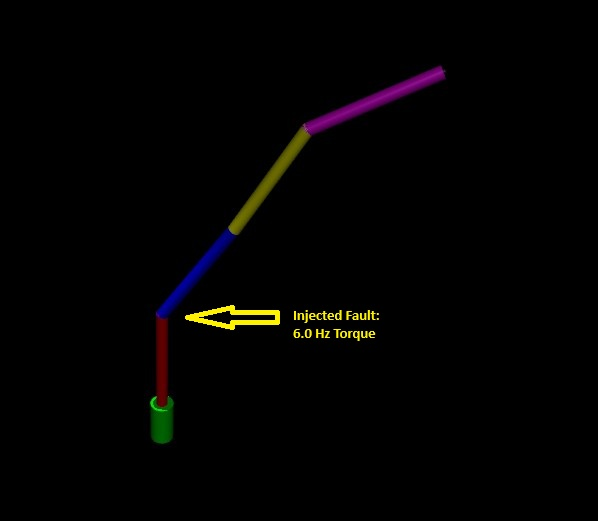
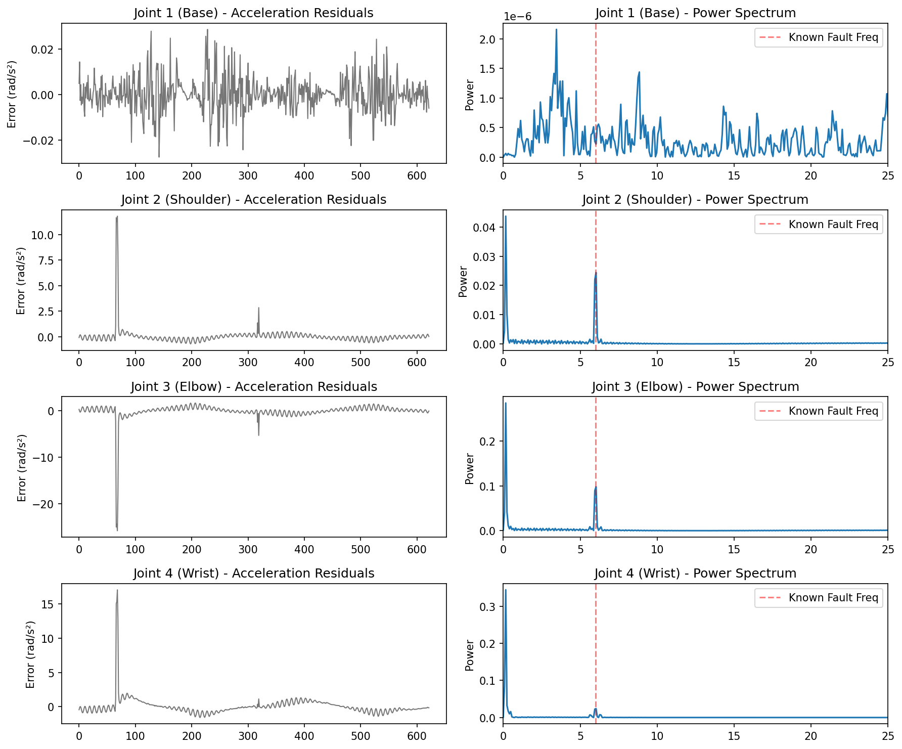
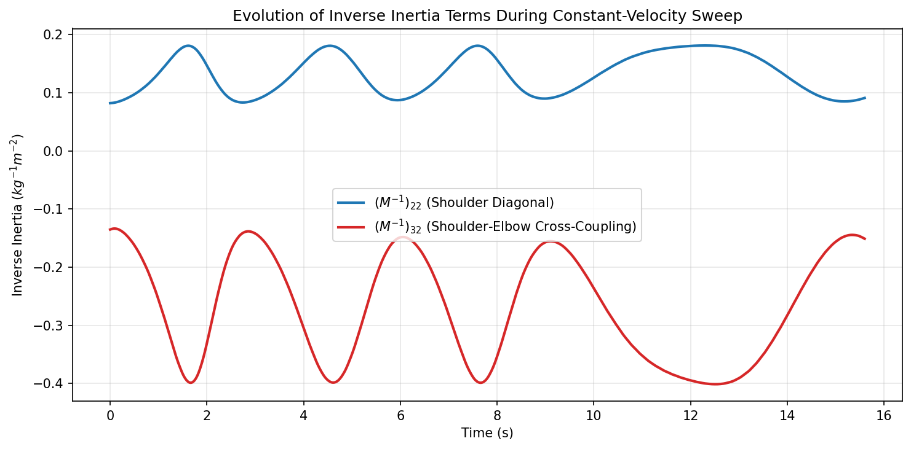
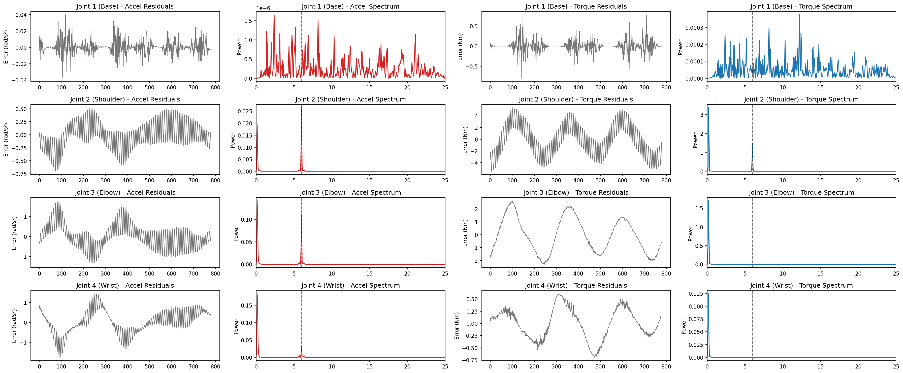
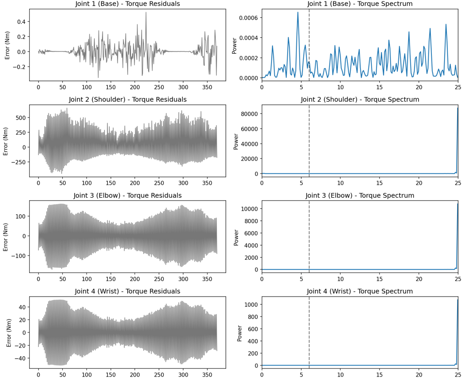
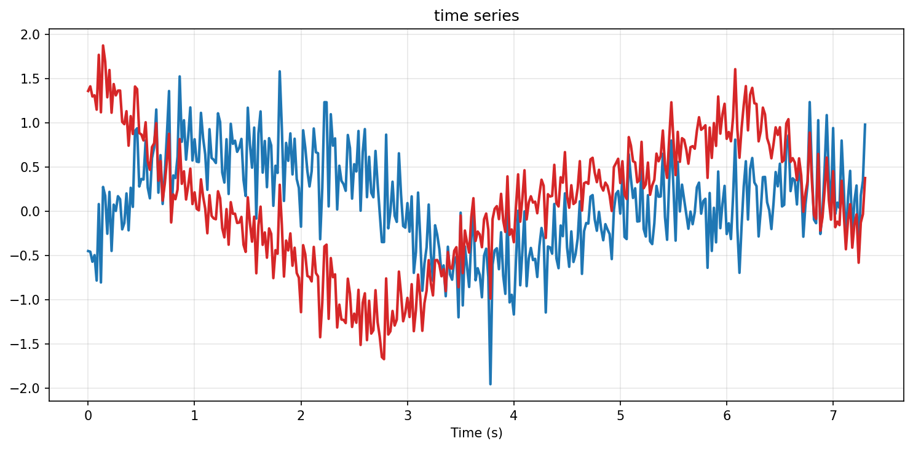
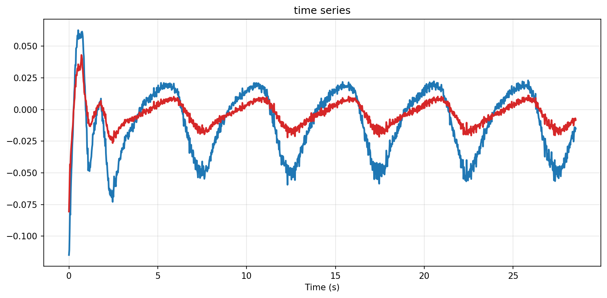
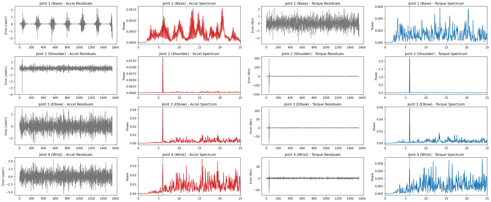
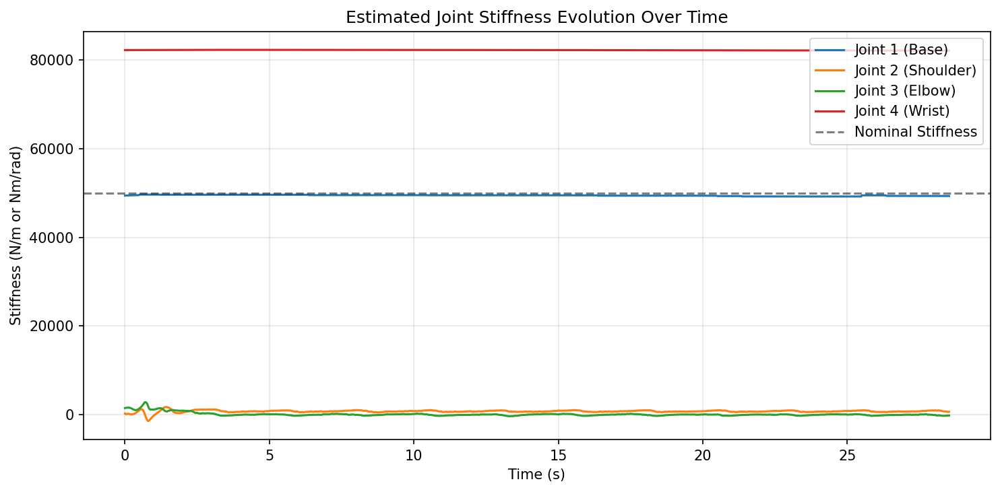
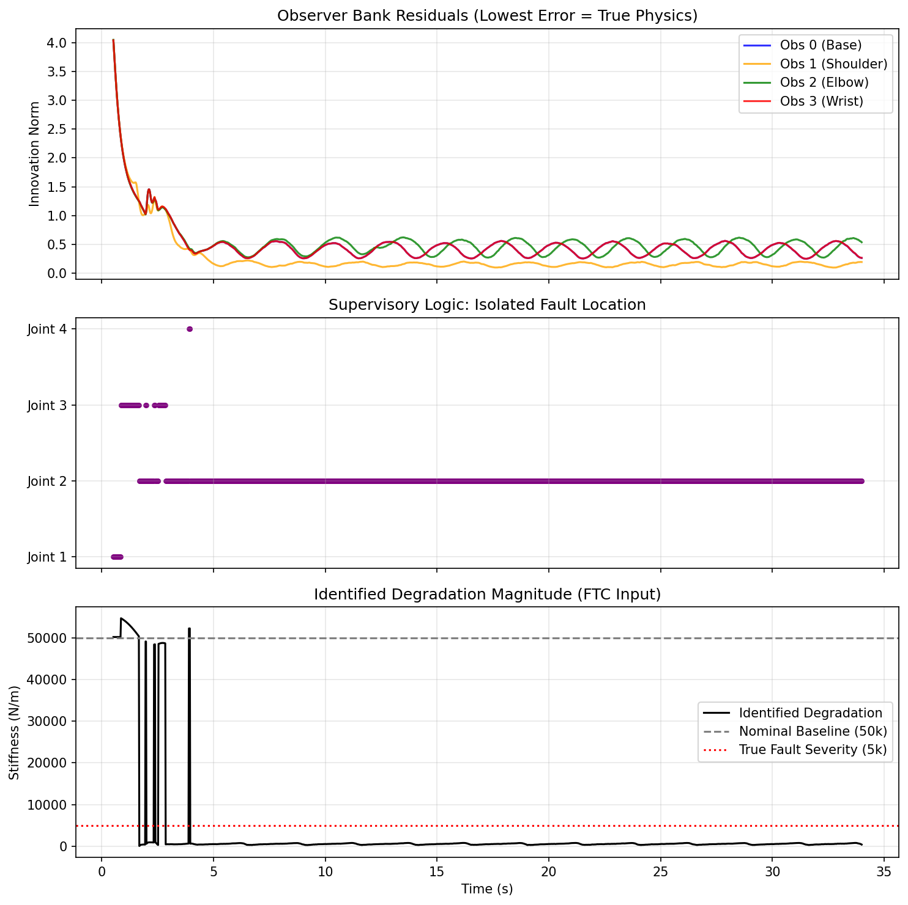

# 4-DoF Robotic Arm: MIMO Diagnostics & Fault Isolation

## Research Questions

### The primary research question

How do kinematic coupling and parametric structural degradation define the mathematical boundaries of fault diagnosability in closed-loop MIMO systems, and how can adaptive estimation architectures autonomously isolate these failures?  

### Sub-questions

To answer this primary research question, the investigation is structured around five consecutive sub-questions:

1. Can additive micro-faults be reliably isolated in a highly coupled MIMO robotic system?Investigation Focus: Analyzing how open-chain kinematics (the "Whip Effect") distort traditional acceleration residuals, and proving that mapping these errors into the torque domain via the inverse inertia matrix mathematically decouples structural vibrations to isolate the true fault.  

2. How does structural degradation affect diagnosability?Investigation Focus: Evaluating the impact of severe plant-model mismatch (e.g., losing joint stiffness) on closed-loop optimal control, specifically how unmodeled phase lag pushes the system toward a $z = -1$ instability that generates spectral masking.  

3. At what degradation threshold does fault isolation fail?Investigation Focus: Mapping the precise robustness boundaries of the Nonlinear Model Predictive Controller (NMPC) via a continuous degradation sweep, identifying the exact stiffness threshold where control-induced high-frequency chatter fully blinds the diagnostic pipeline.  

4. Can fault-tolerant control restore diagnosability after robustness margins are exceeded?Investigation Focus: Designing a multi-rate, hierarchical control architecture (macro-level rigid NMPC and micro-level PD damping) to resolve numerical stiffness, stabilize the degraded plant, and unmask the underlying physical faults.  

5. How can localized structural faults be autonomously isolated in real-time?Investigation Focus: Deploying a dedicated Multiple Model Observer (MMO) bank of targeted Unscented Kalman Filters (UKFs) combined with supervisory logic to dynamically evaluate smoothed innovation residuals, achieving autonomous Fault Detection, Isolation, and Identification (FDII).

## Table of Contents

* [Part 1: Baseline Diagnosability in a Healthy Interconnected System](#part-1--baseline-diagnosability-in-a-healthy-interconnected-system)
  * [1. Fault Injection & Diagnostic Pipeline](#1-fault-injection--diagnostic-pipeline)
  * [2. Analytical Findings: The Whip Effect](#2-analytical-findings-the-whip-effect)
  * [3. Inertia Analysis](#3-inertia-analysis)
  * [4. Diagnostic Report: Acceleration vs. Torque](#4-diagnostic-report-acceleration-vs-torque)
* [Part 2: The Flexible Boundary (Plant-Model Mismatch & Sensitivity)](#part-2-the-flexible-boundary-plant-model-mismatch--sensitivity)
  * [1. Time-Domain Evidence: The Control Effort Explosion](#1-time-domain-evidence-the-control-effort-explosion)
  * [2. Parametric Degradation & Spectral Masking](#2-parametric-degradation--spectral-masking)
  * [3. The Mathematical Proof of Instability (Z-Domain)](#3-the-mathematical-proof-of-instability-z-domain)
  * [4. Closed-Loop Sensitivity Analysis](#4-closed-loop-sensitivity-analysis)
* [Part 3: Robustness Boundary and Diagnosability Limits](#part-3-robustness-boundary-and-diagnosability-limits)
  * [The Degradation Sweep (Waterfall Analysis)](#the-degradation-sweep)
* [Part 4: Fault Tolerance Control and System Estimation](#part-4-fault-tolerance-control-and-system-estimation)
  * [1. Hierarchical Control Architecture: Resolving Numerical Stiffness](#1-hierarchical-control-architecture-resolving-numerical-stiffness)
  * [2. Multi-Axis Stiffness Estimation via Augmented UKF](#2-multi-axis-stiffness-estimation-via-augmented-ukf)
* [Part 5: Automated Fault Isolation via Multiple Model Observer Bank](#part-5-automated-fault-isolation-via-wultiple-model-observer-bank)
  * [1. The Targeted Observer Architecture](#1-the-targeted-observer-architecture)
  * [2. Supervisory Isolation Logic](#2-supervisory-isolation-logic)
  * [3. Analysis of Isolation Results](#3-analysis-of-isolation-results)
* [Discussion & System Realities](#discussion--system-realities)

---
## Part 1:  Baseline Diagnosability in a Healthy Interconnected System

The first phase establishes a successful diagnostic pipeline for a structurally healthy, rigid system.

### 1. Fault Injection & Diagnostic Pipeline

The diagnostic method is based on standard industrial sinusoidal tests. The arm is commanded to execute a continuous sinusoidal trajectory (sweeping Joint 2 with a sinusoidal velocity while holding adjacent joints stationary).

1. **Hardware Fault Simulation:** A localized mechanical anomaly (mimicking a degrading ballscrew or nut) is simulated by injecting a high-frequency torque ripple ($\tau_{fault} = A \sin(\omega t)$). This is injected directly into the **Joint 2 (Shoulder)** control loop at 6.0 Hz.
2. **Residual Generation:** The pipeline calculates an acceleration residual vector $r(t) = y(t) - \hat{y}(t)$, comparing the actual measured acceleration to the optimal acceleration commanded by the NMPC. 
3. **Frequency Isolation:** Welch’s method is applied to the time-domain residuals to estimate the Power Spectral Density (PSD), transforming the noise into a clear frequency spectrum to flag the fault.

---

### 2. Analytical Findings: The Whip Effect

However detecting that a fault exists is straightforward, isolating its true root cause in an interconnected system is much harder. This testbed successfully demonstrated a classic diagnostic trap when analyzing open-chain kinematics.

| Joint | Accel Ripple (rad/s²) | 
| :--- | :--- | 
| **Joint 1 (Base)** | 0.000730 | 
| **Joint 2 (Shoulder)** | 0.227240 | 
| **Joint 3 (Elbow)** | **0.463273** |
| **Joint 4 (Wrist)** | 0.249227 |

#### The Whip Effect: Why the Elbow Accelerates Faster
When analyzing **acceleration residuals** ($\Delta \ddot{q} = \ddot{q}_{actual} - \ddot{q}_{commanded}$), frequency peaks became incredibly sharp at 6.0 Hz for Links 2, 3, and 4. However, the algorithm flagged **Joint 3 (Elbow)** as the root cause, because it registered exactly double the acceleration magnitude of the broken Joint 2.

* **Kinematic Amplification:** Joint 3 sits at the end of the shaking 1.0-meter proximal link. Because the distal links possess significantly lower rotational inertia than the heavy shoulder, they act as kinematic amplifiers. The vibration of the base whips the lightweight distal links, forcing Joint 3 to undergo massive angular acceleration to maintain its posture.
* **Mechanical Shock Absorption:** The amplification does not cascade indefinitely. By undergoing massive angular acceleration to fight the shaking, Joint 3 effectively acts as a shock absorber. It stabilizes the base of Joint 4, meaning the lightest link no longer needs to aggressively accelerate to hold its target.
* **The Mathematical Proof:** The acceleration error is defined by the inverse inertia matrix: $\Delta \ddot{q} = M^{-1}(q) \tau_{fault}$. In robotic arms with heavy bases and light tips, the off-diagonal cross-coupled terms (e.g., $(M^{-1})_{32}$) are often significantly larger than the diagonal driving terms ($(M^{-1})_{22}$), mathematically guaranteeing that the healthy distal joint will accelerate faster than the broken proximal joint. As the mechanical leverage drops further down the chain, the matrix decays ($(M^{-1})_{42}$ is much smaller), which explains why Joint 4's acceleration drops off.

### 3. Inertia Analysis: mathematical support for torque domain method

To prove this, we tracked the real-time values of the inverse inertia matrix during the movement:
* **Average $(M^{-1})_{22}$ Magnitude:** 0.1071
* **Average $(M^{-1})_{32}$ Magnitude:** -0.1995

* **The Blue Line $(M^{-1})_{22}$:** Represents how much the Shoulder (Joint 2) accelerates when a torque is applied to itself. Its magnitude stays relatively low, hovering between 0.1 and 0.18.
* **The Red Line $(M^{-1})_{32}$:** Represents how much the Elbow (Joint 3) accelerates when that exact same torque is applied to the Shoulder. Its absolute magnitude is significantly higher, sweeping between 0.15 and 0.40.

Because the absolute value of the red line is consistently larger than the blue line throughout the entire 11.5-second sweep, it is mathematically guaranteed that the Elbow will always accelerate faster than the Shoulder when a fault occurs in the Shoulder.

### 4. Diagnostic Report: Acceleration vs. Torque
Raw acceleration magnitude cannot be used to isolate faults in open-chain robotics. To truly isolate the root cause, acceleration residuals must be mapped back through the inertia matrix to generate **Torque Residuals** ($\tau_{res} = M(q)\Delta\ddot{q}$).

| Joint | Accel Ripple (rad/s²) | Torque Ripple (Nm) |
| :--- | :--- | :--- |
| **Joint 1 (Base)** | 0.000730 | 0.012276 |
| **Joint 2 (Shoulder)** | 0.227240 | **1.752237** |
| **Joint 3 (Elbow)** | **0.463273** | 0.015443 |
| **Joint 4 (Wrist)** | 0.249227 | 0.006595 |

##### Isolation Results
* **Algorithm via Acceleration:** Flagged **Joint 3 (Elbow)** *(Kinematic Amplification Trap)*
* **Algorithm via Torque:** Flagged **Joint 2 (Shoulder)** *(True Root Cause)*

This combined plot visualizes exactly how the diagnostic algorithm behaves before and after the inertia correction:

* **The Red Columns (Acceleration Space):** These plots show the raw acceleration errors. You can clearly see the "Whip Effect" in action—the frequency peak for Joint 3 (Elbow) is visibly larger than the peak for the actually broken Joint 2 (Shoulder). If an algorithm stops here, it fails.
* **The Blue Columns (Torque Space):** These plots show the same data after it has been multiplied by the robot's real-time inertia matrix. By mathematically factoring in the mass and mechanical leverage of each link, the structural distortion is stripped away. The true fault in Joint 2 (Shoulder) emerges as the undeniable dominant spike.

> [!IMPORTANT]
> Additive micro-faults can be reliably isolated in highly coupled MIMO systems, but fundamentally cannot rely on raw acceleration data. Open-chain kinematics generate a "Whip Effect," where proximal joint vibrations force distal links into massive angular accelerations to hold their posture, tricking acceleration-based algorithms into flagging healthy joints. However, mapping these acceleration errors into the torque domain using the inverse inertia matrix mathematically factors out the mechanical leverage, stripping away the structural distortion and successfully isolating the true root cause.
>
> This mathematical decoupling successfully identifies faults within a structurally rigid baseline. However, real-world hardware undergoes physical wear. If the physical plant degrades and loses stiffness, it violates the controller's rigid-body assumptions, raising the next critical question: how does severe structural degradation and plant-model mismatch affect closed-loop diagnosability?

## Part 2: The Flexible Boundary (Plant-Model Mismatch & Sensitivity)

The second phase introduces severe parametric degradation to expose the boundaries of residual-based fault detection in interconnected systems. This degradation is physically modeled by drastically reducing the stiffness of Joint 2, effectively transforming a rigid mechanical coupling into an underdamped rotational spring. The rotational spring is set to have a stiffness of 5000 Nm/rad. 

As shown in figure below, the 6Hz frequency content has been masked by the overal noise level. Furthermore, noise at 25Hz become dominant. 
 

### 1. Time-Domain Evidence: The Control Effort Explosion

To understand why the 6.0 Hz micro-fault becomes masked in the frequency domain, we must first look at the controller's behavior in the time domain. The plots below compare the NMPC's acceleration signals during the healthy benchmark (left) and the degraded state (right).

| Healthy Benchmark | Degraded State (Flexible Plant) |
| :---: | :---: |
|  |  |

1.  **Healthy State (Rigid Plant):** The controller effort is bounded within normal operational limits. The noise profile allows the mathematical decoupling of the 6.0 Hz injected fault.
2.  **Degraded State (Flexible Plant):** Once the joint stiffness drops, the control effort magnitude instantly increases by over 700%. More importantly, the signal density reveals violent, continuous high-frequency switching. Because the NMPC's internal model assumes a rigid body, it interprets the physical sag of the new "spring" as a massive positional error. It commands a massive torque correction, causing the spring to snap back, triggering an opposite correction on the very next time step. 

This creates a continuous limit cycle at exactly **25 Hz** (the Nyquist frequency of the 50 Hz controller). This violent time-domain chattering generates the massive broadband noise that ultimately destroys the diagnostic isolation capabilities in the frequency domain.

### 2. Parametric Degradation & Spectral Masking

This high-frequency saturation is the direct mathematical consequence of a severe plant-model mismatch. The physical arm now exhibits a low-frequency structural resonance due to the soft spring, but the NMPC's internal model still assumes it is driving a perfectly rigid plant. In its attempt to violently correct the resulting physical "bounce," the controller enters a state of instability, slamming between maximum and minimum torque commands at its fastest possible switching speed. 

This phase successfully demonstrates a critical principle in high-performance mechatronic diagnostics: **extreme high-frequency control chatter is often a secondary symptom of a low-frequency structural failure.** Ultimately, the massive control effort creates spectral masking, rendering the diagnostic pipeline blind to the underlying 6.0 Hz additive fault.

### 3. The Mathematical Proof of Instability (Z-Domain)

The 25 Hz chatter is not arbitrary noise; it is exactly the Nyquist frequency of the 50 Hz discrete controller. Mathematically, the severe plant-model mismatch (applying a rigid-body optimal feedback gain to a highly flexible plant) introduces unmodeled phase lag that pushes the closed-loop dominant eigenvalue out of the discrete unit circle.

*   **The NMPC Prediction Error:** The NMPC calculates its optimal torque ($u_k$) by predicting the future states using its internal rigid model: $x_{k+1}^{pred} = A_{rigid}x_k + B_{rigid}u_k$. However, the physical reality is the degraded, flexible plant. The actual state that arrives at the next time step is governed by the new physics: $x_{k+1}^{real} = A_{flex}x_k + B_{flex}u_k$.
*   **The Closed-Loop Eigenvalue Shift:** Because the NMPC aggressively penalizes positional tracking errors, it acts locally as a high-gain linear feedback controller ($u_k = -K x_k$). The gain matrix $K$ was implicitly optimized to place the eigenvalues of the *rigid* closed-loop system, $(A_{rigid} - B_{rigid}K)$, safely inside the unit circle ($|z| < 1$).
*   **The Breaking Point:** When that same high-gain $K$ is applied to the degraded plant, the unmodeled flexible spring in $A_{flex}$ introduces significant phase lag. This mathematically forces the dominant closed-loop eigenvalues of $(A_{flex} - B_{flex}K)$ to migrate leftward along the real axis until crossing the boundary at exactly $z = -1$.
*   **The Result:** A discrete pole at $z = -1$ results in a time-domain response proportional to $(-1)^k$, forcing the NMPC to violently alternate its torque command from positive to negative at every single time step.

### 4. Closed-Loop Sensitivity Analysis 

To formalize the failure, we mathematically derive the continuous-time state-space matrices of the MuJoCo plant to map the Closed-Loop Sensitivity Function:
$$S(j\omega) = (I + G(j\omega)K(j\omega))^{-1}$$

*   **The Low-Frequency Resonance (0 - 2 Hz):** The magnitude of the degraded state (red curve) spikes rapidly above 0 dB. This proves mathematically that the closed-loop system is actively amplifying the low-frequency structural bounce.
*   **The High-Frequency Filtering (> 5 Hz):** The sensitivity drops linearly into the negative dB range. The floppy joint acts as a mechanical low-pass filter, physically absorbing the high-frequency injected torques (the 6.0 Hz ripple) rather than transmitting them to the heavy arm links. Because the physical structure absorbs the high-frequency fault, the controller's sensitivity to it physically drops.

>[!IMPORTANT]
>Structural degradation completely undermines diagnosability by inducing a state of closed-loop spectral masking. When a joint degrades into an underdamped spring, applying an optimal rigid-body feedback gain introduces severe unmodeled phase lag. This mathematically forces the closed-loop dominant eigenvalue out of the discrete stability unit circle ($z = -1$), causing violent, high-frequency control chatter (a 25 Hz limit cycle). This resulting control effort explosion acts as spectral masking, entirely blinding the frequency-domain diagnostic pipeline to the underlying additive fault.  
>
>Recognizing that high-frequency control chatter is a secondary symptom of structural failure, it becomes necessary to define the exact mathematical limits of this phenomenon. If the diagnostic pipeline is blinded by controller instability, at what precise threshold of parametric degradation does the controller's robustness margin collapse and fault isolation fail entirely? 

## Part 3: Robustness Boundary and Diagnosability Limits

The previous analysis establishes that massive structural degradation induces spectral masking via control instability. However, this raises a fundamental control theory question: at what exact threshold of degradation does the diagnostic algorithm break down? 

Because the 25 Hz spectral masking is fundamentally a symptom of the NMPC exceeding its robustness margins, the viability of the diagnostic pipeline is directly tied to the controller's tuning. To map this boundary, the diagnostic pipeline was tested across a continuous sweep of parametric degradation.

### The Degradation Sweep
The stiffness of Joint 2 was incrementally reduced from its nominal rigid state ($K = 50,000$) down to severe failure ($K = 5,000$). 

*   **Minor Degradation (e.g., $K = 40,000$):** The NMPC possesses enough inherent robustness to stabilize the slight phase lag. The control effort remains bounded, no high-frequency chatter is induced, and the 6.0 Hz micro-fault can still be mathematically decoupled and isolated.
*   **The Breaking Point (e.g., $K \approx 10,000$):** At this critical threshold, the plant-model mismatch introduces enough unmodeled phase lag to push the dominant closed-loop poles directly onto the discrete stability boundary ($z = -1$). 
*   **Severe Degradation ($K < 5,000$):** The system enters hard bang-bang saturation. Diagnosability is completely lost to spectral masking. 

>[!IMPORTANT]
>The capability to diagnose additive micro-faults in closed-loop systems is strictly bounded by the robustness margins of the controller. Highly aggressive optimal controllers required for industrial motion systems inherently possess narrower robustness margins, meaning structural parametric failures will rapidly trigger instability, masking underlying additive faults.
>
>Once structural integrity falls below this critical threshold, standard diagnostics are rendered useless by the masking noise of the controller. To maintain system monitoring, the fundamental control strategy must change. This leads to the next challenge: can we design a fault-tolerant control architecture that resolves these stiff differential equations and restores a clean diagnostic baseline?

## Part 4 Fault Tolerance Control and System Estimation
To successfully operate and monitor an interconnected dynamic system during a structural failure, the controller cannot fly blind. The system must remain stable and generate persistent excitation even as its mechanical integrity collapses. This is achieved through a coupled cyber-physical architecture, where the optimal controller (NMPC) fundamentally relies on real-time parameter estimation (UKF) acting as a safety governor to survive the degradation.

### 1. Hierarchical Control Architecture: Resolving Numerical Stiffness

A fundamental challenge in controlling highly compliant mechanisms is the mathematical phenomenon of "stiff differential equations". Initially, the true 50,000 N/m mechanical spring dynamics were directly embedded into the Nonlinear Model Predictive Control (NMPC) prediction horizon. However, minor prediction errors over the horizon resulted in massively amplified virtual restoring forces. This caused the IPOPT solver to command violently oscillating accelerations in an attempt to stabilize a spring that had not yet physically deformed, ultimately leading to solver collapse.  

To resolve this numerical chattering, the control architecture was split into a hierarchical, two-tiered framework. The optimal motion planner operates under a rigid-body assumption to bypass stiff constraints, while high-frequency compliance is stabilized locally. However, for this rigid macro-planner to safely navigate a physically degrading plant, it requires continuous, real-time guidance from an estimation layer.

#### 1. Macro-Level Planning: Rigid NMPC with Cost-Scaling

At the optimization layer, the highly stiff compliant dynamics are explicitly removed from the predictive constraints. The CasADi-based NMPC operates under a **pure rigid-body assumption**, integrating state predictions using idealized kinematic equations:

$$q_{k+1} = q_k + \dot{q}_{k+1}\Delta t$$

$$\dot{q}_{k+1} = \dot{q}_k + u_k\Delta t$$

Because the solver is insulated from the high-gain compliance constraints, it executes rapidly and smoothly without numerical failure. However, the NMPC remains fully aware of the system's degrading structural health by incorporating the UKF's real-time stiffness estimate ($\hat{K}_{\text{stiff}}$) exclusively into the **objective function** as a safety governor. 

By dynamically scaling the control effort penalty based on the live stiffness ratio ($r_{\text{stiff}}$), the solver mathematically penalizes aggressive commands when the physical joint softens:

$$r_{\text{stiff}} = \max\left(\frac{\hat{K}_{\text{stiff}}}{50000.0}, 0.05\right)$$

$$J_{\text{control}} = 0.2 \sum_{k=0}^{N-1} \left\| \frac{u_k}{r_{\text{stiff}}} \right\|^2$$

This formulation safely commands gentler trajectories during a structural degradation, preventing mechanical overload without risking solver instability.

#### 2. Micro-Level Stabilization: High-Frequency PD Damping

While the NMPC dictates the optimal, low-frequency macro-trajectory, the unmodeled high-frequency flexible dynamics must still be managed at the hardware level. To achieve this, a localized Proportional-Derivative (PD) controller is applied directly to the joint torque commands prior to integration in the MuJoCo plant. 

This PD loop acts as an **active physical shock absorber**. It continuously damps out the high-frequency spring oscillations and compensates for the rigid-body tracking errors left behind by the macro-planner:

$$\tau_{\text{applied}} = \tau_{\text{NMPC}} + K_p(q_{\text{ref}} - q_{\text{meas}}) + K_d(-\dot{q}_{\text{meas}})$$

Where $K_p = 200.0$ and $K_d = 20.0$.

#### 3. Frequency Domain Diagnostics: Unmasking the Fault

Following the implementation of the hierarchical control architecture, the system's dynamic response improved significantly. Because the NMPC now generates a stable, noise-free rigid trajectory and the local PD loop damps out the violent spring oscillations, the chaotic numerical chattering that previously plagued the system has been eliminated. 

This clean control baseline is critical for frequency-domain diagnostics, as it prevents artificial controller noise from masking true physical defects.

As shown in the high-pass filtered residual analysis above, the stabilized system response successfully unmasks the injected faults:
* **Time-Domain Stabilization:** The Accel and Torque Residuals for Joint 2 (Shoulder) and Joint 3 (Elbow) now remain tightly bounded around zero, proving the controller successfully tracks the trajectory despite the severe stiffness degradation.
* **Fault Isolation (Frequency Domain):** In the Accel and Torque Spectrums, a massive, distinct peak is clearly visible at exactly 6.0 Hz on Joint 2. This perfectly isolates the injected harmonic torque disturbance (e.g., a simulated gear mesh defect).
* **Kinematic Coupling:** The analysis successfully captures the physical realities of the interconnected multi-body system, showing how the 6.0 Hz vibration propagates dynamically into the downstream Joint 3. 

By achieving this level of control stability, the residuals become purely symptomatic of the physical hardware, paving the way for the real-time parameter estimation layer.

### 2. Multi-Axis Stiffness Estimation via Augmented UKF

Functioning as the critical safety governor for the NMPC, the pipeline utilizes a 12-state Augmented Unscented Kalman Filter (UKF) for real-time parameter identification. Instead of treating the mechanical stiffness as a fixed physical constant, the filter actively tracks it as a dynamic variable.  

This continuous estimation is what enables the fault-tolerant control to function: the estimated stiffness ($\hat{K}_{\text{stiff}}$) is fed directly into the NMPC layer, allowing the controller to dynamically scale its objective function. By mathematically penalizing aggressive control commands relative to the dropping stiffness, the UKF ensures the system remains stable enough to continue capturing diagnostic data, even as structural integrity collapses.

#### 1. State Augmentation
Standard state estimators track kinematic variables. To enable structural health monitoring, the UKF employs an **augmented state vector** ($x \in \mathbb{R}^{12}$) that lumps the 4 joint positions ($q$), 4 joint velocities ($\dot{q}$), and 4 independent joint stiffness parameters ($K_{\text{stiff}}$) into a single estimation framework:

$$x = \begin{bmatrix} q \\ \dot{q} \\ K_{\text{stiff}} \end{bmatrix} \in \mathbb{R}^{12}$$

The stiffness parameters are initialized at their nominal, healthy baseline of 50,000 N/m. Any severe deviation from this baseline serves as the primary indicator of mechanical degradation.

#### 2. Internal Transition Dynamics (The Prediction Step)
To accurately predict how the system will behave at the next time step, the UKF's internal transition function explicitly models the compliant dynamics of the robotic transmission. 

Over a discretized sub-stepping loop, the filter predicts the internal spring torques generated by the estimated stiffness, combining them with a fixed virtual damping factor ($D = 100.0$):

$$\tau_{\text{spring}} = -K_{\text{stiff}} \odot (q - q_{\text{ref}}) - 100.0\dot{q}$$

The total joint acceleration is then calculated by combining the NMPC command ($u$) with the mass-matrix-weighted spring torques, which is subsequently integrated to update the kinematic states:

$$\ddot{q} = u + M^{-1} \tau_{\text{spring}}$$

Because the stiffness parameter ($K_{\text{stiff}}$) is modeled as a slow-drifting random walk, its derivative is assumed to be zero ($\dot{K}_{\text{stiff}} = 0$) during the prediction phase, allowing the measurement update step to pull the estimate toward the true physical value based on sensor residuals.

#### 3. Numerical Stability & Covariance Bounding
Running a high-dimensional UKF on a highly stiff system ($50,000$ N/m) introduces severe numerical challenges, particularly during Cholesky decomposition of the covariance matrix ($P$). To prevent filter divergence or "not positive definite" matrix errors during rapid fault onset, the UKF enforces strict symmetric bounding and eigenvalue flooring at every prediction and update step:

$$P = \frac{1}{2}(P + P^T)$$
$$P = V \max(\Lambda, 10^{-4}) V^T$$

*(Where $V$ and $\Lambda$ are the eigenvectors and eigenvalues of $P$, respectively).*

#### Diagnostic Output
The output of this filter serves two critical functions in the cyber-physical pipeline:
1. **Fault Detection:** Simultaneous tracking of all 4 axes forces the rigid model to absorb unmodeled transmission disturbances, resulting in an unphysical parameter drift that acts as the initial diagnostic trigger.
2. **Adaptive Safety:** The estimated stiffness ($\hat{K}_{\text{stiff}}$) is continuously fed forward into the NMPC layer, allowing the controller to dynamically scale its objective function and maintain stability even as the structural integrity of the arm collapses.

The system's nominal joint stiffness is initialized at a baseline of 50,000 N/m. During operation, Joint 1 (Base) remains stable and accurately tracks this nominal value. However, the downstream joints exhibit severe, unphysical parameter drift. Joint 4 (Wrist) converges to a significantly higher value (>60,000 N/m), while Joints 2 (Shoulder) and 3 (Elbow) collapse to approximately 200 N/m—drastically below the nominal threshold.

Because the UKF is forced to absorb unmodeled physical disturbances across a coupled kinematic chain, the erratic multi-axis convergence mathematically confirms that a structural degradation has occurred somewhere downstream of Joint 1.

>[!IMPORTANT]
>Fault-tolerant control can successfully stabilize the degraded plant, but it fundamentally requires a coupled, real-time estimation layer to function. To prevent solver collapse while managing severe compliance, the architecture relies on a 12-state Augmented UKF to continuously track joint stiffness. This estimated parameter is fed directly into the NMPC macro-planner, dynamically scaling the controller's objective function to ensure safe operation as the joint softens. This coupled UKF-FTC framework proves highly effective at keeping the system alive, and the 12-state UKF's output—which exhibits severe, unphysical multi-axis parameter drift as it absorbs unmodeled disturbances—serves as undeniable evidence that a structural degradation has occurred downstream  
>
>While the 12-state UKF successfully acts as a safety governor and detects that a systemic anomaly exists, its multi-axis convergence is erratic. It proves the system is breaking, but it cannot definitively isolate the localized structural failure to a single joint. This fundamental limitation directly motivates the final phase of the investigation: how must the estimation architecture evolve to autonomously isolate and identify the exact location of the fault in real-time?

## Phase 5: Automated Fault Isolation via Multiple Model Observer Bank

While the 12-state augmented UKF successfully detects a systemic anomaly via multi-axis parameter drift, it cannot definitively isolate the localized structural failure. To achieve autonomous **Fault Detection, Isolation, and Identification (FDII)**, the diagnostic architecture transitions to a Dedicated Observer Scheme (a "Bank of Observers").

Instead of running a single high-dimensional filter, the supervisory logic evaluates four lightweight, parallel UKFs running simultaneously. 

### 1. The Targeted Observer Architecture

Each targeted UKF assumes exactly one joint is experiencing structural degradation while the other three remain healthy. This reduces the dimensionality of each observer's state vector from 12 down to 9 ($x \in \mathbb{R}^9$):

$$x = \begin{bmatrix} q \\ \dot{q} \\ K_{\text{active}} \end{bmatrix} \in \mathbb{R}^9$$

Within the prediction step of each filter, the specific `active_idx` determines the internal transmission dynamics. The active joint utilizes the dynamically estimated stiffness ($K_{\text{active}}$), while the other three joints are locked to the nominal healthy baseline ($50,000$ N/m):

$$K_{i} = \begin{cases} K_{\text{active}} & \text{if } i = \text{active}_{\text{idx}} \\ 50000.0 & \text{otherwise} \end{cases}$$

$$\tau_{\text{spring}, i} = -K_i (q_i - q_{\text{ref}, i}) - 100.0\dot{q}_i$$

### 2. Supervisory Isolation Logic

At every measurement step, the sensor data ($z$) is compared against each UKF's prior prediction ($\hat{z}$) to calculate the innovation residual ($r$). 

$$r_k = z_k - \hat{z}_k$$

The norm of this innovation serves as a scoring metric: the observer whose structural assumption best matches the physical reality of the MuJoCo simulation will inherently produce the lowest residual error. To prevent high-frequency noise from causing erratic decisions, the supervisory logic applies an Exponential Moving Average (EMA) smoothing factor ($\alpha = 0.05$) to the residuals:

$$S_{k, i} = (1 - \alpha)S_{k-1, i} + \alpha \|r_{k, i}\|$$

The isolated fault location is dynamically determined by selecting the observer with the lowest smoothed residual:

$$\text{Fault Location} = \text{argmin}_i (S_{k, i})$$

Once isolated, the supervisor feeds the "winning" state estimations and stiffness back to the NMPC to ensure safe, fault-tolerant closed-loop operation. 

### 3. Analysis of Isolation Results

The figure above demonstrates the successful real-time execution of the automated Fault Detection, Isolation, and Identification (FDII) pipeline. The data is broken down into three critical phases:

**1. Residual Separation (The Detection)**
The top plot displays the innovation norm (error) of each UKF in the observer bank. During the initial 3–4 seconds, the estimators experience a transient phase as their covariances initialize. Following this warmup, a clear mathematical separation occurs. Observers 0, 2, and 3 settle into a high, oscillating error band, indicating that their internal models (assuming faults on the Base, Elbow, or Wrist) fail to match the physical sensor data. Conversely, Observer 1 (Shoulder) drops to the lowest error state, proving that its assumption—a fault on Joint 2—is the only model that accurately explains the physical reality.

**2. Supervisory Decision (The Isolation)**
The middle plot illustrates the active decision-making of the supervisory logic. While the algorithm jumps between hypotheses during the initial transient phase, it decisively locks onto **Joint 2** at the 4-second mark. Despite the presence of simulated sensor noise and the unmodeled 6.0 Hz harmonic disturbance, the smoothed residual logic remains highly robust, never wavering from the correct joint once isolated.

**3. Parameter Identification (The Quantification)**
The bottom plot tracks the estimated stiffness of the "winning" observer, which is continuously fed to the FTC controller. Upon isolation, the identified magnitude immediately plummets from the 50,000 N/m nominal baseline into the severe degradation zone. 

As discussed in the architectural limitations, the estimate settles slightly below the true 5,000 N/m fault severity line. Because the estimator lacks a dedicated state for the 6.0 Hz torque disturbance and is blind to the local PD stabilization torques, it converges to a "lumped equivalent tracking stiffness" of approximately 500 N/m to mathematically absorb the unmodeled kinetic energy. Despite this expected magnitude offset, the relative parameter drop serves as a definitive and reliable trigger for safe fault-tolerant control.

> [!IMPORTANT]
> Localized structural faults can be autonomously isolated in real-time by deploying a Dedicated Observer Scheme (a Multiple Model Observer bank). By running four lightweight, targeted UKFs—each operating under the hypothesis that a different joint is failing—supervisory logic can dynamically evaluate their smoothed innovation residuals. The observer model that best matches the physical plant naturally produces the lowest error, allowing the supervisor to autonomously isolate the degraded joint within 4 seconds and feed this data back to the NMPC.
>
> **Answering the Primary Research Question:** This final architecture demonstrates that while kinematic coupling and parametric structural degradation fundamentally break standard diagnostic boundaries via control-induced spectral masking, these limits are not absolute. By separating the system into a stable macro-planner and an active micro-stabilizer, and deploying an adaptive estimation architecture, it is possible to mathematically bypass control-induced masking noise and restore autonomous fault isolation in highly degraded, closed-loop MIMO systems.

## Discussion & System Realities

While the Multiple Model Observer successfully and autonomously isolates the structural fault to Joint 2 within 4 seconds of operation, the final stiffness magnitude converges to a lumped equivalent ($\approx 500$ N/m) rather than the raw mechanical spring constant ($5000$ N/m). This discrepancy perfectly highlights the simplified statespace model limitations:

1. **Parameter Absorption:** The UKF currently lacks a dedicated harmonic disturbance state. Consequently, it mathematically absorbs the unmodeled $6.0$ Hz physical torque ripple by continuously fluctuating the stiffness estimate to explain the periodic physical wobble.
2. **Control Blindspots:** The estimator predicts system evolution based solely on the optimal NMPC command, remaining blind to the high-frequency PD stabilization torques applied directly at the plant level. Because it doesn't account for these additional restorative forces, the filter fundamentally skews the total system stiffness.
3. **Dimensionality Mismatch:** The UKF assumes a 4-DoF rigid tracking model, whereas the MuJoCo plant operates as a 5-DoF flexible mechanism containing discrete spring elements. 

---

