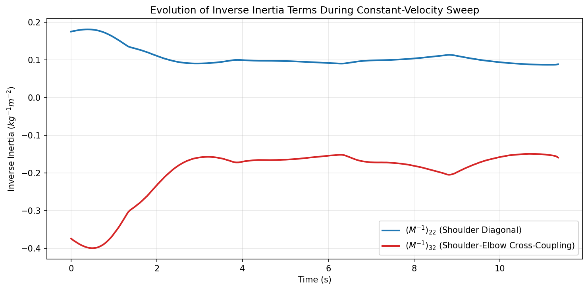

# 4-DoF Robotic Arm: MIMO Diagnostics & Fault Isolation

A high-fidelity simulation of a 4 Degree-of-Freedom (4-DOF) interconnected robotic arm. This project serves as a testbed for advanced nonlinear control (NMPC), state estimation (UKF), and frequency-domain fault diagnostics in complex, multi-variable dynamic systems.

The primary research objective of this repository is to successfully isolate localized mechanical degradation (such as actuator wear) from cross-coupled structural vibrations across interconnected joints.

---

## System Architecture

The simulation bridges realistic sensor noise, state estimation, and whole-body nonlinear optimal control.

* **Physics Engine:** MuJoCo (Python bindings) executing forward dynamics at 500 Hz.
* **Optimal Control (NMPC):** Powered by CasADi. The controller embeds the full nonlinear rigid body dynamics ($M(q)\ddot{q} + C(q, \dot{q})\dot{q} + G(q) = \tau$) within a 20-step prediction horizon. This allows the arm to track trajectories while natively compensating for shifting gravity vectors and Coriolis forces that linear models cannot handle.
* **State Estimation (UKF):** An Unscented Kalman Filter runs at 50 Hz, fusing noisy joint position and velocity sensor data to generate clean, nonlinearly-derived state estimates ($\hat{q}, \hat{\dot{q}}$) for the control loop.

---

## Fault Injection & Diagnostic Pipeline

The diagnpstic methodology was inpired by the constant speed test used often in industries. To replicate the diagnostic tests, the arm is commanded to execute a continuous triangle-wave trajectory in joint space (sweeping Joint 2 at a constant velocity while holding adjacent joint angles stationary).

1. **Hardware Fault Simulation:** A localized mechanical anomaly (mimicking a degrading ballscrew or nut) is modeled as a high-frequency sinusoidal torque disturbance ($\tau_{fault} = A \sin(\omega t)$). This is injected directly into the **Joint 2 (Shoulder)** control loop at 6.0 Hz.
2. **Residual Generation:** The pipeline calculates a aaceleration residual vector $r(t) = y(t) - \hat{y}(t)$, comparing the feedback acceleration to the NMPC calculated optimal acceleration. 
3. **Frequency Isolation:** Welch’s method is applied to the time-domain residuals to estimate the Power Spectral Density (PSD), transforming the noise into a clear frequency spectrum to flag anomalous harmonics.

---

## Analytical Findings: The Pitfalls of MIMO Fault Isolation

Detecting a fault is straightforward; isolating its root cause in an interconnected Multi-Input Multi-Output (MIMO) system presents complex mathematical and physical challenges. This testbed successfully demonstrated two classic diagnostic traps when analyzing open-chain kinematics.

### Acceleration Space & Kinematic Amplification (The Whip Effect)
The pipeline analyzes **acceleration residuals** ($\Delta \ddot{q} = \ddot{q}_{actual} - \ddot{q}_{commanded}$). While the frequency peaks became incredibly sharp, the absolute power comparison flagged **Joint 3 (Elbow)** as the root cause, registering exactly double the acceleration magnitude of the broken Joint 2.
* **The Physics (Kinematic Amplification):** Joint 3 sits at the end of the shaking 1.0-meter proximal link. Because the distal links possess significantly lower rotational inertia than the heavy shoulder, they act as kinematic amplifiers. The vibration of the base whips the lightweight distal links, forcing Joint 3 to undergo massive angular acceleration to maintain its posture.
* **The Physics (Mechanical Shock Absorption):** The amplification does not cascade indefinitely. By undergoing massive angular acceleration to fight the structural shaking, Joint 3 effectively acts as a mechanical shock absorber. It stabilizes the base of Joint 4, meaning the lightest link no longer needs to aggressively accelerate to hold its target.
* **The Mathematical Proof:** The acceleration error is defined by the inverse inertia matrix: $\Delta \ddot{q} = M^{-1}(q) \tau_{fault}$. In robotic arms with heavy bases and light tips, the off-diagonal cross-coupled terms (e.g., $(M^{-1})_{32}$) are often significantly larger than the diagonal driving terms ($(M^{-1})_{22}$), mathematically guaranteeing that the healthy distal joint will accelerate faster than the broken proximal joint. However, as the mechanical leverage is broken by free-moving pivots further down the chain, the matrix decays (i.e., $(M^{-1})_{42}$ is much smaller), which explains the drop-off in Joint 4's acceleration.
### INERTIA ANALYSIS COMPLETE
* **Average (M^-1)_22 Magnitude: 0.1071
* ** Average (M^-1)_32 Magnitude: -0.1995

* **The Controller Influence:** The NMPC formulation dynamically weights the distal links higher to prioritize End-Effector stability. When the fault occurs, the solver actively sacrifices the stability of Joint 3 (allowing wild accelerations) specifically to protect Joint 4 and keep the wrist on target.
* **The Conclusion:** Raw acceleration magnitude cannot be used to isolate faults in open-chain robotics. To truly isolate the root cause, acceleration residuals must be mapped back through the inertia matrix to generate **Torque Residuals** ($\tau_{res} = M(q)\Delta\ddot{q}$).

### Diagnostic Report: Acceleration vs. Torque

| Joint | Accel Ripple (rad/s²) | Torque Ripple (Nm) |
| :--- | :--- | :--- |
| **Joint 1 (Base)** | 0.000730 | 0.012276 |
| **Joint 2 (Shoulder)** | 0.227240 | **1.752237** |
| **Joint 3 (Elbow)** | **0.463273** | 0.015443 |
| **Joint 4 (Wrist)** | 0.249227 | 0.006595 |

#### Isolation Results
* **Algorithm via Acceleration:** Flagged **Joint 3 (Elbow)** *(Kinematic Amplification Trap)*
* **Algorithm via Torque:** Flagged **Joint 2 (Shoulder)** *(True Root Cause)*

---

---
