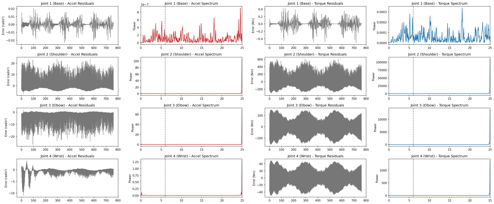

# 4-DoF Robotic Arm: MIMO Diagnostics & Fault Isolation

This repository serves as a testbed for fault detection methodology in highly coupled, multi-input multi-output (MIMO) mechatronic systems, 4DoF. The objective of this project is twofold: first, to successfully decouple and extract additive micro-faults from the torque domain without taking the system offline; and second, to investigate the mathematical boundaries of this diagnostic approach when subjected to massive parametric degradation.

The investigation is structured into two phases: 

* establishing a rigid-body diagnostic baseline,
* subsequently breaking that baseline to analyze closed-loop sensitivity during a structural failure.

---

## System Architecture

The simulation combines sensor noise, state estimation, and whole-body optimal control.

* **Physics Engine:** MuJoCo (Python bindings) executing forward dynamics at 500 Hz.
* **Optimal Control (NMPC):** Powered by CasADi. The controller embeds the full nonlinear rigid body dynamics ($M(q)\ddot{q} + C(q, \dot{q})\dot{q} + G(q) = \tau$) within a 20-step prediction horizon. This allows the arm to track trajectories while natively compensating for shifting gravity and Coriolis forces.
* **State Estimation (UKF):** An Unscented Kalman Filter runs at 50 Hz, fusing noisy joint position and velocity sensor data to generate clean state estimates ($\hat{q}, \hat{\dot{q}}$) for the control loop.

---
## Part 1: The Rigid Body Baseline

The first phase establishes a successful diagnostic pipeline for a structurally healthy, rigid system.

### 1. Fault Injection & Diagnostic Pipeline

The diagnostic method is based on standard industrial constant-speed tests. The arm is commanded to execute a continuous triangle-wave trajectory (sweeping Joint 2 at a constant velocity while holding adjacent joints stationary).

1. **Hardware Fault Simulation:** A localized mechanical anomaly (mimicking a degrading ballscrew or nut) is simulated by injecting a high-frequency torque ripple ($\tau_{fault} = A \sin(\omega t)$). This is injected directly into the **Joint 2 (Shoulder)** control loop at 6.0 Hz.
2. **Residual Generation:** The pipeline calculates an acceleration residual vector $r(t) = y(t) - \hat{y}(t)$, comparing the actual measured acceleration to the optimal acceleration commanded by the NMPC. 
3. **Frequency Isolation:** Welch’s method is applied to the time-domain residuals to estimate the Power Spectral Density (PSD), transforming the noise into a clear frequency spectrum to flag the fault.

---

### 2. Analytical Findings

Detecting that a fault exists is straightforward; isolating its true root cause in an interconnected system is much harder. This testbed successfully demonstrated a classic diagnostic trap when analyzing open-chain kinematics.

#### The Whip Effect: Why the Elbow Accelerates Faster
When analyzing **acceleration residuals** ($\Delta \ddot{q} = \ddot{q}_{actual} - \ddot{q}_{commanded}$), frequency peaks became incredibly sharp at 6.0 Hz for Links 2, 3, and 4. However, the algorithm flagged **Joint 3 (Elbow)** as the root cause, because it registered exactly double the acceleration magnitude of the broken Joint 2.

* **Kinematic Amplification:** Joint 3 sits at the end of the shaking 1.0-meter proximal link. Because the distal links possess significantly lower rotational inertia than the heavy shoulder, they act as kinematic amplifiers. The vibration of the base whips the lightweight distal links, forcing Joint 3 to undergo massive angular acceleration to maintain its posture.
* **Mechanical Shock Absorption:** The amplification does not cascade indefinitely. By undergoing massive angular acceleration to fight the shaking, Joint 3 effectively acts as a shock absorber. It stabilizes the base of Joint 4, meaning the lightest link no longer needs to aggressively accelerate to hold its target.
* **The Mathematical Proof:** The acceleration error is defined by the inverse inertia matrix: $\Delta \ddot{q} = M^{-1}(q) \tau_{fault}$. In robotic arms with heavy bases and light tips, the off-diagonal cross-coupled terms (e.g., $(M^{-1})_{32}$) are often significantly larger than the diagonal driving terms ($(M^{-1})_{22}$), mathematically guaranteeing that the healthy distal joint will accelerate faster than the broken proximal joint. As the mechanical leverage drops further down the chain, the matrix decays ($(M^{-1})_{42}$ is much smaller), which explains why Joint 4's acceleration drops off.

### 3. Inertia Analysis

To prove this, we tracked the real-time values of the inverse inertia matrix during the movement:
* **Average $(M^{-1})_{22}$ Magnitude:** 0.1071
* **Average $(M^{-1})_{32}$ Magnitude:** -0.1995

* **The Blue Line $(M^{-1})_{22}$:** Represents how much the Shoulder (Joint 2) accelerates when a torque is applied to itself. Its magnitude stays relatively low, hovering between 0.1 and 0.18.
* **The Red Line $(M^{-1})_{32}$:** Represents how much the Elbow (Joint 3) accelerates when that exact same torque is applied to the Shoulder. Its absolute magnitude is significantly higher, sweeping between 0.15 and 0.40.

Because the absolute value of the red line is consistently larger than the blue line throughout the entire 11.5-second sweep, it is mathematically guaranteed that the Elbow will always accelerate faster than the Shoulder when a fault occurs in the Shoulder.

### 4. The Conclusion
Raw acceleration magnitude cannot be used to isolate faults in open-chain robotics. To truly isolate the root cause, acceleration residuals must be mapped back through the inertia matrix to generate **Torque Residuals** ($\tau_{res} = M(q)\Delta\ddot{q}$).

---

#### Diagnostic Report: Acceleration vs. Torque

| Joint | Accel Ripple (rad/s²) | Torque Ripple (Nm) |
| :--- | :--- | :--- |
| **Joint 1 (Base)** | 0.000730 | 0.012276 |
| **Joint 2 (Shoulder)** | 0.227240 | **1.752237** |
| **Joint 3 (Elbow)** | **0.463273** | 0.015443 |
| **Joint 4 (Wrist)** | 0.249227 | 0.006595 |

This combined plot visualizes exactly how the diagnostic algorithm behaves before and after the inertia correction:

* **The Red Columns (Acceleration Space):** These plots show the raw acceleration errors. You can clearly see the "Whip Effect" in action—the frequency peak for Joint 3 (Elbow) is visibly larger than the peak for the actually broken Joint 2 (Shoulder). If an algorithm stops here, it fails.
* **The Blue Columns (Torque Space):** These plots show the same data after it has been multiplied by the robot's real-time inertia matrix. By mathematically factoring in the mass and mechanical leverage of each link, the structural distortion is stripped away. The true fault in Joint 2 (Shoulder) emerges as the undeniable dominant spike.

#### Isolation Results
* **Algorithm via Acceleration:** Flagged **Joint 3 (Elbow)** *(Kinematic Amplification Trap)*
* **Algorithm via Torque:** Flagged **Joint 2 (Shoulder)** *(True Root Cause)*

## Part 2: The Flexible Boundary (Plant-Model Mismatch & Sensitivity)

The second phase introduces severe parametric degradation to expose the boundaries of residual-based fault detection. The degration is modeled as a spring at joint 2. 

### 1. Parametric Degradation & Spectral Masking

As demonstrated in the spectral analysis plot above, the previously isolated 6.0 Hz micro-fault is now completely subsumed by overwhelming broadband noise. The power spectrum is dominated by massive new frequency content—reaching magnitudes in the thousands—that peaks sharply at 25 Hz (the Nyquist limit of the 50 Hz discrete controller).

This high-frequency saturation is the direct mathematical consequence of a severe plant-model mismatch. The physical arm now exhibits a low-frequency structural resonance due to the soft spring, but the NMPC's internal model still assumes it is driving a perfectly rigid plant. In its attempt to violently correct the resulting physical "bounce," the controller enters a state of instability, slamming between maximum and minimum torque commands at its fastest possible switching speed.

### 2. Closed-Loop Sensitivity Analysis

