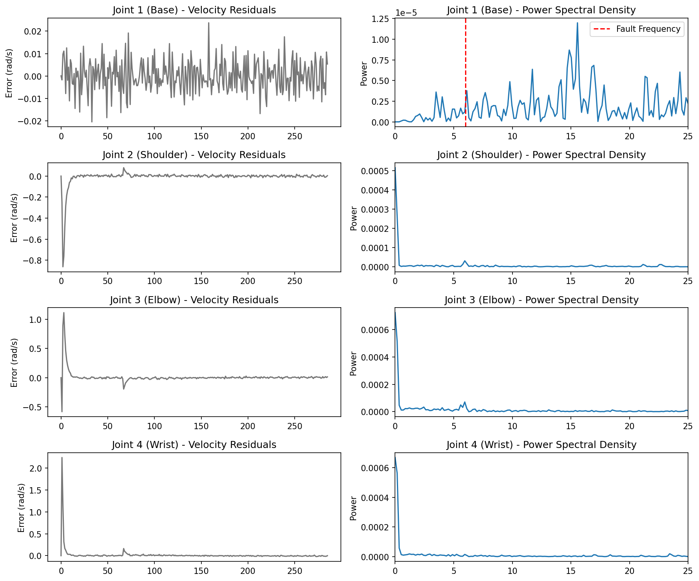
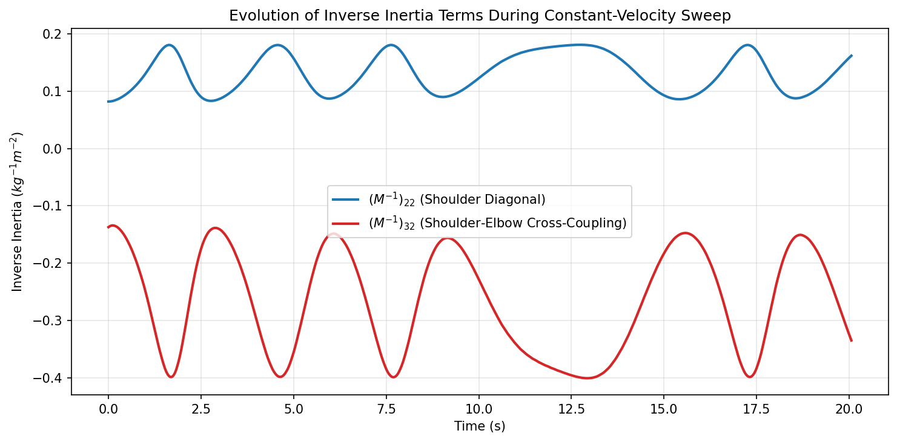
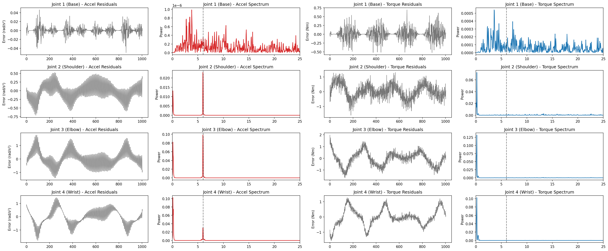
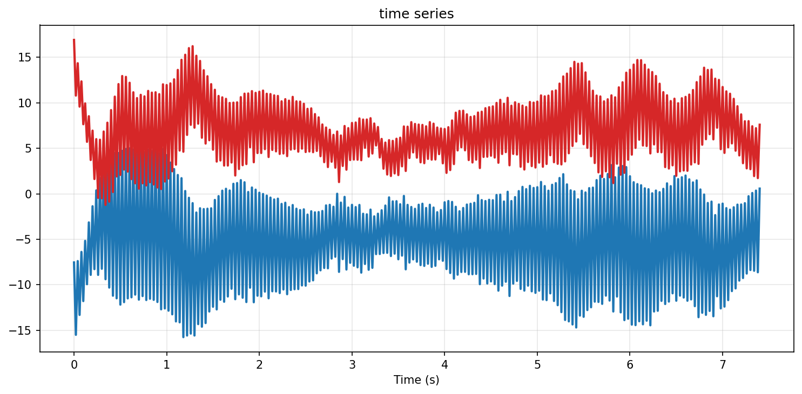
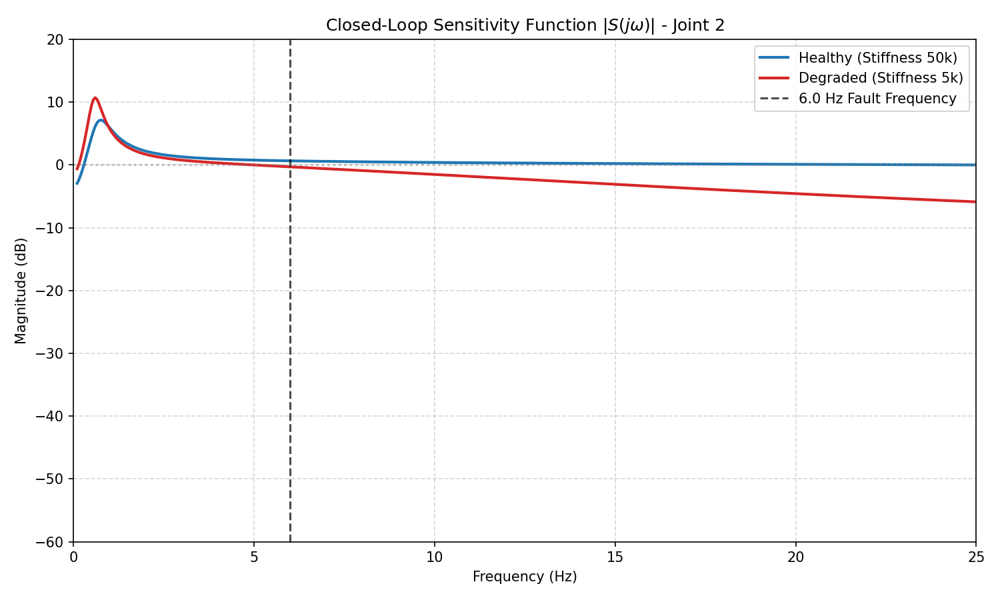
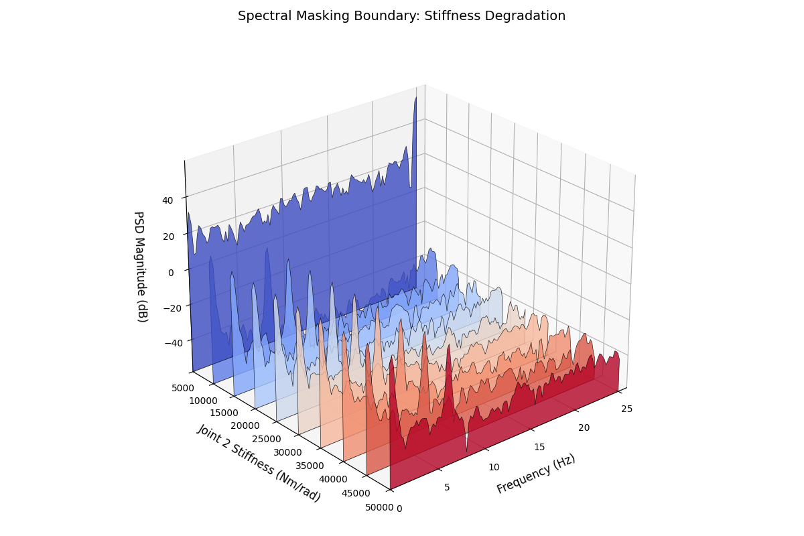

# 4-DoF Robotic Arm: MIMO Diagnostics & Fault Isolation

This repository serves as a testbed for fault detection methodology in highly coupled, multi-input multi-output (MIMO) mechatronic systems, 4DoF arm. The objective of this project is twofold: first, to successfully detect micro-faults from the torque domain; and second, to investigate the mathematical boundaries of this diagnostic approach when subjected to massive parametric degradation.

The investigation is structured into two phases: 

* establishing a rigid-body diagnostic baseline, a torque ripple of 6Hz was introduced at joint 2 to simulate a a degrading ballscrew or nut.
* subsequently breaking that baseline to analyze closed-loop sensitivity during a structural degradation This degradation is physically modeled by drastically reducing the stiffness of Joint 2, effectively transforming a rigid mechanical coupling into an underdamped rotational spring
* investigate the robustness of this methodology 

## Table of Contents

* [Part 1: The Rigid Body Baseline](#part-1-the-rigid-body-baseline-mathematical-decoupling)
  * [1. Fault Injection & Diagnostic Pipeline](#1-fault-injection--diagnostic-pipeline)
  * [2. Analytical Findings: The Whip Effect](#2-analytical-findings-the-whip-effect)
  * [3. Inertia Analysis](#3-inertia-analysis)
  * [4. Diagnostic Report: Acceleration vs. Torque](#4-diagnostic-report-acceleration-vs-torque)
* [Part 2: The Flexible Boundary (Plant-Model Mismatch & Sensitivity)](#part-2-the-flexible-boundary-plant-model-mismatch--sensitivity)
  * [1. Time-Domain Evidence: The Control Effort Explosion](#1-time-domain-evidence-the-control-effort-explosion)
  * [2. Parametric Degradation & Spectral Masking](#2-parametric-degradation--spectral-masking)
  * [3. The Mathematical Proof of Instability (Z-Domain)](#3-the-mathematical-proof-of-instability-z-domain)
  * [4. Closed-Loop Sensitivity Analysis](#4-closed-loop-sensitivity-analysis)
* [Part 3: Robustness Boundary and Diagnosability Limits](#part-3-robustness-boundary-and-diagnosability-limits)
  * [The Degradation Sweep (Waterfall Analysis)](#the-degradation-sweep-waterfall-analysis)
  * [Conclusion](#conclusion)
* [System Architecture](#system-architecture)

---
## Part 1: The Rigid Body Baseline

The first phase establishes a successful diagnostic pipeline for a structurally healthy, rigid system.

### 1. Fault Injection & Diagnostic Pipeline

The diagnostic method is based on standard industrial sinusoidal tests. The arm is commanded to execute a continuous sinusoidal trajectory (sweeping Joint 2 with a sinusoidal velocity while holding adjacent joints stationary).

1. **Hardware Fault Simulation:** A localized mechanical anomaly (mimicking a degrading ballscrew or nut) is simulated by injecting a high-frequency torque ripple ($\tau_{fault} = A \sin(\omega t)$). This is injected directly into the **Joint 2 (Shoulder)** control loop at 6.0 Hz.
2. **Residual Generation:** The pipeline calculates an acceleration residual vector $r(t) = y(t) - \hat{y}(t)$, comparing the actual measured acceleration to the optimal acceleration commanded by the NMPC. 
3. **Frequency Isolation:** Welch’s method is applied to the time-domain residuals to estimate the Power Spectral Density (PSD), transforming the noise into a clear frequency spectrum to flag the fault.

---

### 2. Analytical Findings: The Whip Effect

However detecting that a fault exists is straightforward, isolating its true root cause in an interconnected system is much harder. This testbed successfully demonstrated a classic diagnostic trap when analyzing open-chain kinematics.

| Joint | Accel Ripple (rad/s²) | 
| :--- | :--- | 
| **Joint 1 (Base)** | 0.000730 | 
| **Joint 2 (Shoulder)** | 0.227240 | 
| **Joint 3 (Elbow)** | **0.463273** |
| **Joint 4 (Wrist)** | 0.249227 |

#### The Whip Effect: Why the Elbow Accelerates Faster
When analyzing **acceleration residuals** ($\Delta \ddot{q} = \ddot{q}_{actual} - \ddot{q}_{commanded}$), frequency peaks became incredibly sharp at 6.0 Hz for Links 2, 3, and 4. However, the algorithm flagged **Joint 3 (Elbow)** as the root cause, because it registered exactly double the acceleration magnitude of the broken Joint 2.

* **Kinematic Amplification:** Joint 3 sits at the end of the shaking 1.0-meter proximal link. Because the distal links possess significantly lower rotational inertia than the heavy shoulder, they act as kinematic amplifiers. The vibration of the base whips the lightweight distal links, forcing Joint 3 to undergo massive angular acceleration to maintain its posture.
* **Mechanical Shock Absorption:** The amplification does not cascade indefinitely. By undergoing massive angular acceleration to fight the shaking, Joint 3 effectively acts as a shock absorber. It stabilizes the base of Joint 4, meaning the lightest link no longer needs to aggressively accelerate to hold its target.
* **The Mathematical Proof:** The acceleration error is defined by the inverse inertia matrix: $\Delta \ddot{q} = M^{-1}(q) \tau_{fault}$. In robotic arms with heavy bases and light tips, the off-diagonal cross-coupled terms (e.g., $(M^{-1})_{32}$) are often significantly larger than the diagonal driving terms ($(M^{-1})_{22}$), mathematically guaranteeing that the healthy distal joint will accelerate faster than the broken proximal joint. As the mechanical leverage drops further down the chain, the matrix decays ($(M^{-1})_{42}$ is much smaller), which explains why Joint 4's acceleration drops off.

### 3. Inertia Analysis: mathematical support for torque domain method

To prove this, we tracked the real-time values of the inverse inertia matrix during the movement:
* **Average $(M^{-1})_{22}$ Magnitude:** 0.1071
* **Average $(M^{-1})_{32}$ Magnitude:** -0.1995

* **The Blue Line $(M^{-1})_{22}$:** Represents how much the Shoulder (Joint 2) accelerates when a torque is applied to itself. Its magnitude stays relatively low, hovering between 0.1 and 0.18.
* **The Red Line $(M^{-1})_{32}$:** Represents how much the Elbow (Joint 3) accelerates when that exact same torque is applied to the Shoulder. Its absolute magnitude is significantly higher, sweeping between 0.15 and 0.40.

Because the absolute value of the red line is consistently larger than the blue line throughout the entire 11.5-second sweep, it is mathematically guaranteed that the Elbow will always accelerate faster than the Shoulder when a fault occurs in the Shoulder.

### 4. Diagnostic Report: Acceleration vs. Torque
Raw acceleration magnitude cannot be used to isolate faults in open-chain robotics. To truly isolate the root cause, acceleration residuals must be mapped back through the inertia matrix to generate **Torque Residuals** ($\tau_{res} = M(q)\Delta\ddot{q}$).

| Joint | Accel Ripple (rad/s²) | Torque Ripple (Nm) |
| :--- | :--- | :--- |
| **Joint 1 (Base)** | 0.000730 | 0.012276 |
| **Joint 2 (Shoulder)** | 0.227240 | **1.752237** |
| **Joint 3 (Elbow)** | **0.463273** | 0.015443 |
| **Joint 4 (Wrist)** | 0.249227 | 0.006595 |

This combined plot visualizes exactly how the diagnostic algorithm behaves before and after the inertia correction:

* **The Red Columns (Acceleration Space):** These plots show the raw acceleration errors. You can clearly see the "Whip Effect" in action—the frequency peak for Joint 3 (Elbow) is visibly larger than the peak for the actually broken Joint 2 (Shoulder). If an algorithm stops here, it fails.
* **The Blue Columns (Torque Space):** These plots show the same data after it has been multiplied by the robot's real-time inertia matrix. By mathematically factoring in the mass and mechanical leverage of each link, the structural distortion is stripped away. The true fault in Joint 2 (Shoulder) emerges as the undeniable dominant spike.

##### Isolation Results
* **Algorithm via Acceleration:** Flagged **Joint 3 (Elbow)** *(Kinematic Amplification Trap)*
* **Algorithm via Torque:** Flagged **Joint 2 (Shoulder)** *(True Root Cause)*

## Part 2: The Flexible Boundary (Plant-Model Mismatch & Sensitivity)

The second phase introduces severe parametric degradation to expose the boundaries of residual-based fault detection in interconnected systems. This degradation is physically modeled by drastically reducing the stiffness of Joint 2, effectively transforming a rigid mechanical coupling into an underdamped rotational spring. The rotational spring is set to have a stiffness of 5000 Nm/rad. 

As shown in figure below, the 6Hz frequency content has been masked by the overal noise level. Furthermore, noise at 25Hz become dominant. 
 

### 1. Time-Domain Evidence: The Control Effort Explosion

To understand why the 6.0 Hz micro-fault becomes masked in the frequency domain, we must first look at the controller's behavior in the time domain. The plots below compare the NMPC's acceleration signals during the healthy benchmark (left) and the degraded state (right).

| Healthy Benchmark | Degraded State (Flexible Plant) |
| :---: | :---: |
|  |  |

1.  **Healthy State (Rigid Plant):** The controller effort is bounded within normal operational limits. The noise profile allows the mathematical decoupling of the 6.0 Hz injected fault.
2.  **Degraded State (Flexible Plant):** Once the joint stiffness drops, the control effort magnitude instantly increases by over 700%. More importantly, the signal density reveals violent, continuous high-frequency switching. Because the NMPC's internal model assumes a rigid body, it interprets the physical sag of the new "spring" as a massive positional error. It commands a massive torque correction, causing the spring to snap back, triggering an opposite correction on the very next time step. 

This creates a continuous limit cycle at exactly **25 Hz** (the Nyquist frequency of the 50 Hz controller). This violent time-domain chattering generates the massive broadband noise that ultimately destroys the diagnostic isolation capabilities in the frequency domain.

### 2. Parametric Degradation & Spectral Masking

This high-frequency saturation is the direct mathematical consequence of a severe plant-model mismatch. The physical arm now exhibits a low-frequency structural resonance due to the soft spring, but the NMPC's internal model still assumes it is driving a perfectly rigid plant. In its attempt to violently correct the resulting physical "bounce," the controller enters a state of instability, slamming between maximum and minimum torque commands at its fastest possible switching speed. 

This phase successfully demonstrates a critical principle in high-performance mechatronic diagnostics: **extreme high-frequency control chatter is often a secondary symptom of a low-frequency structural failure.** Ultimately, the massive control effort creates spectral masking, rendering the diagnostic pipeline blind to the underlying 6.0 Hz additive fault.

### 3. The Mathematical Proof of Instability (Z-Domain)

The 25 Hz chatter is not arbitrary noise; it is exactly the Nyquist frequency of the 50 Hz discrete controller. Mathematically, the severe plant-model mismatch (applying a rigid-body optimal feedback gain to a highly flexible plant) introduces unmodeled phase lag that pushes the closed-loop dominant eigenvalue out of the discrete unit circle.

*   **The NMPC Prediction Error:** The NMPC calculates its optimal torque ($u_k$) by predicting the future states using its internal rigid model: $x_{k+1}^{pred} = A_{rigid}x_k + B_{rigid}u_k$. However, the physical reality is the degraded, flexible plant. The actual state that arrives at the next time step is governed by the new physics: $x_{k+1}^{real} = A_{flex}x_k + B_{flex}u_k$.
*   **The Closed-Loop Eigenvalue Shift:** Because the NMPC aggressively penalizes positional tracking errors, it acts locally as a high-gain linear feedback controller ($u_k = -K x_k$). The gain matrix $K$ was implicitly optimized to place the eigenvalues of the *rigid* closed-loop system, $(A_{rigid} - B_{rigid}K)$, safely inside the unit circle ($|z| < 1$).
*   **The Breaking Point:** When that same high-gain $K$ is applied to the degraded plant, the unmodeled flexible spring in $A_{flex}$ introduces significant phase lag. This mathematically forces the dominant closed-loop eigenvalues of $(A_{flex} - B_{flex}K)$ to migrate leftward along the real axis until crossing the boundary at exactly $z = -1$.
*   **The Result:** A discrete pole at $z = -1$ results in a time-domain response proportional to $(-1)^k$, forcing the NMPC to violently alternate its torque command from positive to negative at every single time step.

### 4. Closed-Loop Sensitivity Analysis 

To formalize the failure, we mathematically derive the continuous-time state-space matrices of the MuJoCo plant to map the Closed-Loop Sensitivity Function:
$$S(j\omega) = (I + G(j\omega)K(j\omega))^{-1}$$

*   **The Low-Frequency Resonance (0 - 2 Hz):** The magnitude of the degraded state (red curve) spikes rapidly above 0 dB. This proves mathematically that the closed-loop system is actively amplifying the low-frequency structural bounce.
*   **The High-Frequency Filtering (> 5 Hz):** The sensitivity drops linearly into the negative dB range. The floppy joint acts as a mechanical low-pass filter, physically absorbing the high-frequency injected torques (the 6.0 Hz ripple) rather than transmitting them to the heavy arm links. Because the physical structure absorbs the high-frequency fault, the controller's sensitivity to it physically drops.

## Part 3: Robustness Boundary and Diagnosability Limits

The previous analysis establishes that massive structural degradation induces spectral masking via control instability. However, this raises a fundamental control theory question: at what exact threshold of degradation does the diagnostic algorithm break down? 

Because the 25 Hz spectral masking is fundamentally a symptom of the NMPC exceeding its robustness margins, the viability of the diagnostic pipeline is directly tied to the controller's tuning. To map this boundary, the diagnostic pipeline was tested across a continuous sweep of parametric degradation.

### The Degradation Sweep
The stiffness of Joint 2 was incrementally reduced from its nominal rigid state ($K = 50,000$) down to severe failure ($K = 5,000$). 

*   **Minor Degradation (e.g., $K = 40,000$):** The NMPC possesses enough inherent robustness to stabilize the slight phase lag. The control effort remains bounded, no high-frequency chatter is induced, and the 6.0 Hz micro-fault can still be mathematically decoupled and isolated.
*   **The Breaking Point (e.g., $K \approx 10,000$):** At this critical threshold, the plant-model mismatch introduces enough unmodeled phase lag to push the dominant closed-loop poles directly onto the discrete stability boundary ($z = -1$). 
*   **Severe Degradation ($K < 5,000$):** The system enters hard bang-bang saturation. Diagnosability is completely lost to spectral masking. 

### Conclusion
The capability to diagnose additive micro-faults in closed-loop systems is strictly bounded by the robustness margins of the controller. Highly aggressive optimal controllers required for industrial motion systems inherently possess narrower robustness margins, meaning structural parametric failures will rapidly trigger instability, masking underlying additive faults.

## System Architecture

The simulation combines sensor noise, state estimation, and whole-body optimal control.

* **Physics Engine:** MuJoCo (Python bindings) executing forward dynamics at 500 Hz.
* **Optimal Control (NMPC):** Powered by CasADi. The controller embeds the full nonlinear rigid body dynamics ($M(q)\ddot{q} + C(q, \dot{q})\dot{q} + G(q) = \tau$) within a 20-step prediction horizon. This allows the arm to track trajectories while natively compensating for shifting gravity and Coriolis forces.
* **State Estimation (UKF):** An Unscented Kalman Filter runs at 50 Hz, fusing noisy joint position and velocity sensor data to generate clean state estimates ($\hat{q}, \hat{\dot{q}}$) for the control loop.
---

